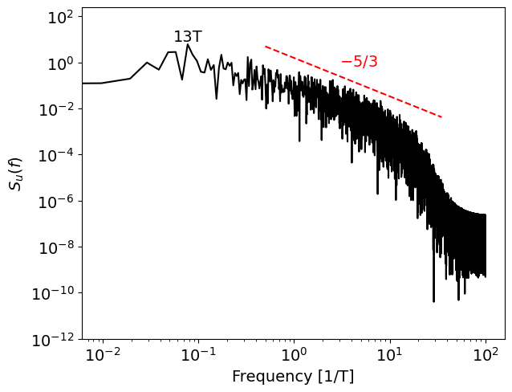

# Energy Spectrum Analysis using Fourier Transform

This repository contains a Python script for **power spectrum analysis** of a time series of velocity in a turbulent flow using the **Fast Fourier Transform (FFT)**. The script reads data from a CSV file, processes it to calculate the power spectrum, and verifies variance consistency.

---

## 📋 **Code Description**

The script performs the following steps:

### 1. **Data Reading and Preprocessing**
- The data is read from a CSV file (`data_test_spectrum_u.csv`), containing two columns: **time** and **series values (u)**.
- A linear trend is removed using `scipy.signal.detrend`.
- The mean is subtracted to center the data around zero.
- The time series is padded with zeros to make it periodic, which is required for the FFT.

### 2. **Power Spectrum Calculation**
- The Fast Fourier Transform (FFT) is applied to the padded time series.
- The energy spectrum is computed from the FFT coefficients, assuming signal periodicity.
- The corresponding frequencies are generated.

### 3. **Variance Checking**
- The original variance of the time series is compared to the variance calculated from the FFT-derived spectrum.
- Both variances are printed to ensure consistency.

### 4. **Power Spectrum Visualization**
- The power spectrum is plotted on a **log-log scale**.
- A reference line with a slope of **-5/3** is added to the plot for comparison.
- The peak energy is identified and annotated with its corresponding period (inverse of frequency).

---

## 📊 **Power Spectrum Plot**

The resulting energy spectrum is shown below:

---

## 🛠️ **Dependencies**

This script requires the following Python libraries:

- **NumPy**: For numerical calculations and array manipulations.
- **SciPy**: For removing trends from the time series.
- **Matplotlib**: For plotting the power spectrum.

### Install Dependencies:
To install the required libraries, run:

```bash
pip install numpy scipy matplotlib
